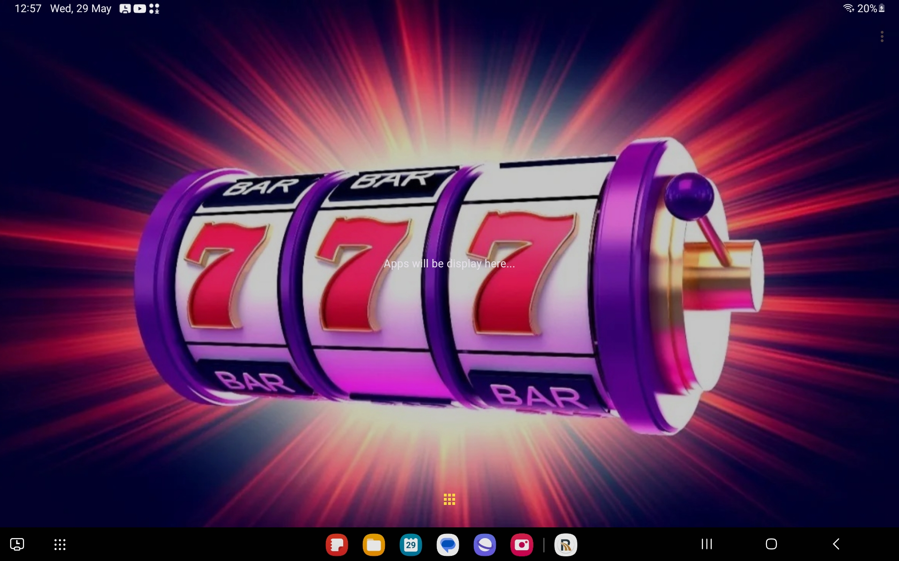
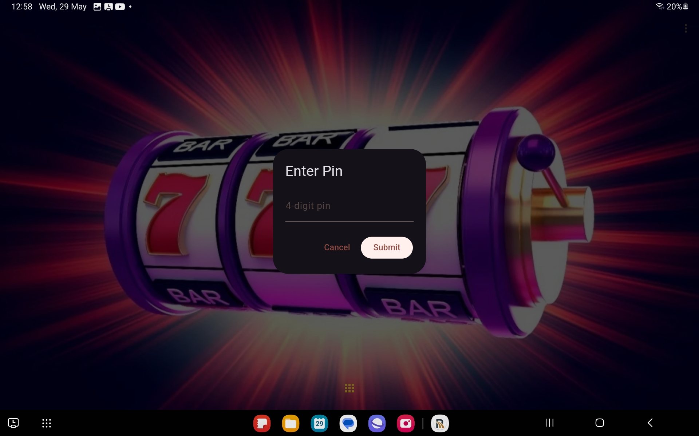
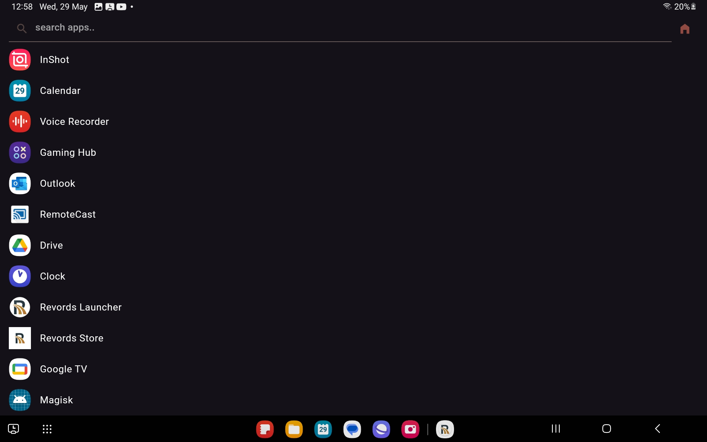
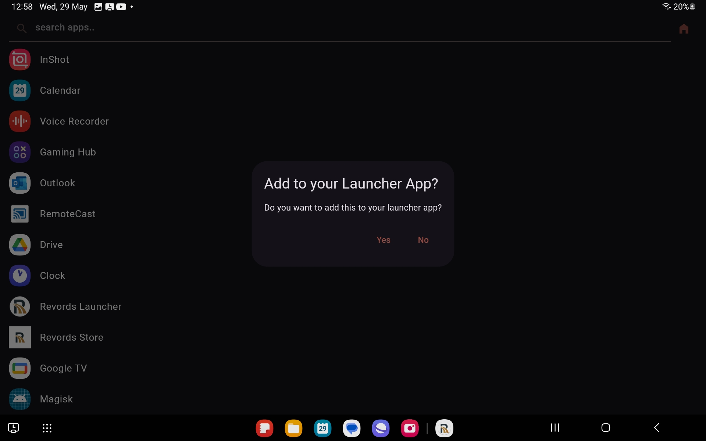

[Learn to build article](https://www.appwriters.dev/blog/lets-build-an-android-launcher-application-with-flutter)

## Preview

 

## Features
- You can add your installed application into our Home Page of the launcher app. So that we can keep that application into a Kiosk mode.
- You can also put an exit into the application by putting navigation into the application.
